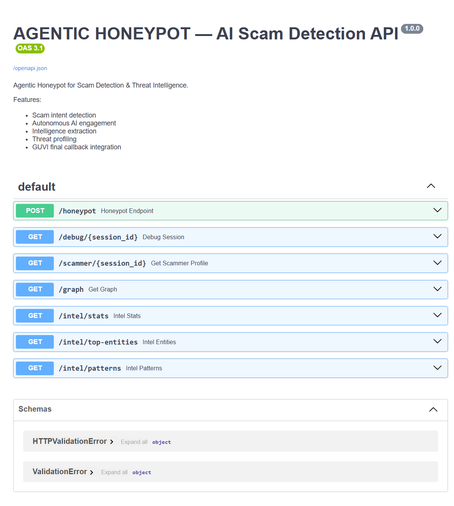
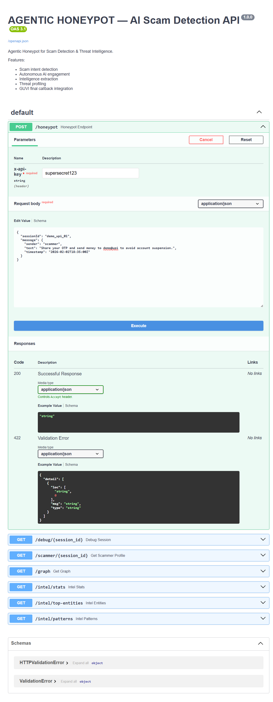
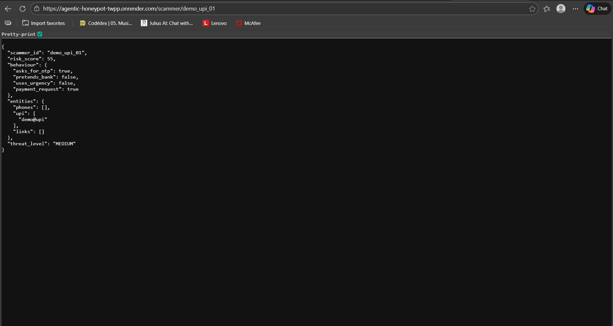

# AGENTIC HONEYPOT — AI Scam Detection & Threat Intelligence Platform

AGENTIC HONEYPOT is a production-grade **Agentic Cybersecurity System** that autonomously detects scam intent, engages scammers using AI, extracts actionable intelligence, builds scammer risk profiles, and reports structured results via REST APIs.

This project was built for the **GUVI Hackathon — Problem Statement 2** and is deployed as a live cloud service.

---

## 🚀 Live Deployment

**Base URL:**  
https://agentic-honeypot-twpp.onrender.com

**Swagger UI:**  
https://agentic-honeypot-twpp.onrender.com/docs

---

## 🔐 API Authentication

All API requests require an API key.

```
x-api-key: supersecret123
```

---

## 🎯 Core Features

- Scam intent detection using LLM  
- Autonomous AI agent engagement  
- Multi-turn conversation handling  
- Intelligence extraction:
  - UPI IDs  
  - Phone numbers  
  - Phishing links  
  - Suspicious keywords  
- Threat profiling:
  - Risk score (0–100)  
  - Behaviour flags  
  - Threat level  
- Threat actor network graph  
- Final GUVI callback integration  
- Production-ready REST API  

---

## 📡 Main API Endpoint (Required by GUVI)

### POST `/honeypot`

Accepts scam messages and returns an AI-generated response.

### Example Request

```json
{
  "sessionId": "demo_01",
  "message": {
    "sender": "scammer",
    "text": "Your bank account will be blocked. Share OTP and UPI test@upi immediately.",
    "timestamp": "2026-02-02T22:00:00Z"
  }
}
```

### Example Response

```json
{
  "status": "success",
  "scamDetected": true,
  "reply": "Why is my account being suspended?"
}
```

---

## 🧠 Intelligence & Profiling Endpoints

| Endpoint | Description |
|---------|------------|
| GET `/debug/{session_id}` | Full conversation & intelligence |
| GET `/scammer/{session_id}` | Scammer risk profile |
| GET `/graph` | Threat actor network |
| GET `/intel/stats` | Global statistics |
| GET `/intel/top-entities` | Top extracted entities |
| GET `/intel/patterns` | Scam patterns |

---

## 🧪 How to Test (Production)

Open Swagger UI:

```
https://agentic-honeypot-twpp.onrender.com/docs
```

Use `POST /honeypot` with API key.

---

## 🏗 System Architecture

1. Incoming scam message  
2. Scam intent detection  
3. Autonomous AI agent engagement  
4. Intelligence extraction  
5. Behaviour analysis  
6. Risk scoring & threat level  
7. Final callback to GUVI evaluation endpoint  

---

## 🛠 Tech Stack

- FastAPI (Backend)  
- Python  
- Groq LLM (AI Agent)  
- Render (Cloud Deployment)  
- Streamlit (SOC Dashboard)  
- REST APIs  
- OpenAPI / Swagger  

---

## 💻 Run Locally

```bash
git clone https://github.com/TahaShaikh018/agentic-honeypot
cd agentic-honeypot

python -m venv venv
venv\Scripts\activate

pip install -r requirements.txt
uvicorn app.main:app --reload
```

Open:
```
http://127.0.0.1:8000/docs
```

---

## ☁ Deployment

This project is deployed on **Render** using:

```bash
uvicorn app.main:app --host 0.0.0.0 --port 10000
```

---

## 📸 Screenshots

Add these screenshots in a folder named `/screenshots`:

```markdown




```

---

## 🏁 Final Outcome

AGENTIC HONEYPOT is a real-world **AI-driven cybersecurity platform** capable of:

- Engaging real scammers  
- Extracting actionable threat intelligence  
- Building behavioral risk profiles  
- Operating as a real SOC-style system  

---

## 👤 Author

**Taha Shaikh**  
B.Tech Artificial Intelligence & Data Science  
Agentic AI & Cybersecurity Developer  

---

## 📄 License

MIT License
